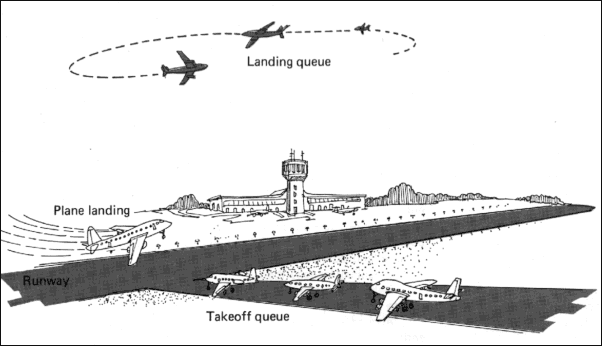

# algoritmer1_Flyplassen
Dette er min løsning av den 2. obligatoriske oppgaven i faget "Algoritmer og datastrukturer" på Høgskolen i Østfold.

## Oppgavetekst
I den første obligatoriske oppgaven skal det lages et Java-program som simulerer et køsystem. Det skal brukes tidsdrevet simulering, dvs. at programmet skal "gå i små tidssteg" og simulere hva som skjer innenfor hver tidsperiode.

### Systemregler
Systemet vi skal modellere er en liten (men travel) flyplass med bare en rullebane og to køer med fly:
  
*Fra Programming with Data Structures - Pascal Version av Robert L. Kruse.*

Reglene for denne flyplassen (og for oppførselen av systemet vi skal simulere) er:
- Innenfor en tidsenhet kan enten et fly lande eller et fly ta av. Begge deler kan ikke skje innen en tidsenhet.
- Fly ankommer for å lande eller ta av til tilfeldige tidspunkter. Hvis rullebanen er opptatt, vil et fly måtte stille seg bakerst i køen av fly som venter på å lande eller ta av.
- Siden det er viktigst å få flyene ned på bakken (før de går tom for bensin), vil et fly få ta av bare hvis landingskøen er tom.
- Det er begrenset plass i køene for landing og avgang (f.eks. maks 10 fly i kø). Hvis køene er fulle, vil fly som ankommer bli avvist.
- Ved start av simuleringen skal flyplassen være tom.

### Implementasjon
Antall fly som kommer inn til hhv. landingskøen og avgangskøen i løpet av en tidsenhet skal trekkes tilfeldig. Trekningen skal gjøres med utgangspunkt i det gjennomsnittlige antall fly som ankommer per tidsenhet.

En slik trekning kan gjøres ved å bruke en såkalt Poisson-fordeling. Følgende kode vil generere tilfeldige tall med en gjennomsnittsverdi lik parameteren mean:
```
    private static int getPoissonRandom(double mean)
    {
	Random r = new Random();
	double L = Math.exp(-mean);
	int k = 0;
	double p = 1.0;
	do
        {
	    p = p * r.nextDouble();
	    k++;
	} while (p > L);
	return k - 1;
    }
```

Summen av det gjennomsnittlige antall fly som kommer til henholdsvis avgang og landing i en tidsenhet bør forøvrig ikke ikke overstige 1.0 (hvorfor?).

Programmet skal inneholde to vanlige køer, som skal lagre fly-objekter. 

Bruker av programmet skal angi antall tidssteg simuleringen skal gå, og gjennomsnittsfrekvensene for landing og avgang.

I hvert tidssteg skal programmet skrive ut hva som skjer på flyplassen (fly lander, fly tar av, fly kommer til landing, fly kommer til avgang, flyplassen tom). Programmet skal også "samle opp" informasjon under simuleringen, og til slutt skrive ut en oppsummering av simuleringens forløp. Passende størrelser å registrere kan f.eks. være:
- Totalt antall fly som ankom.
- Antall fly som landet og tok av.
- Antall fly som ble avvist fra flyplassen.
- Gjennomsnittlig lengde av eller histogrammer for lengde av de to køene.
- Prosentandel av tiden der flyplassen stod tom.
- Gjennomsnittlige ventetider i køene.

Følgende algoritme kan brukes som utgangspunkt for simuleringsprogrammet:
```
    Les data/parameterverdier for simuleringen fra bruker

    Initier begge køene til å være tomme
    
    For hver tidssteg i simuleringen
    
        Trekk et tilfeldig antall nye fly som kommer for å lande
    
        For hvert nytt fly som kommer for å lande
            Hvis landingskøen er full
                Avvis det nye flyet (henvis til annen flyplass)
            ellers
                Sett det nye flyet sist i landingskøen
          
        Trekk et tilfeldig antall nye fly som kommer for å ta av
    
        For hvert nytt fly som kommer for å ta av
            Hvis avgangskøen er full
                Avvis det nye flyet (avgang må prøves senere)
            ellers
                Sett det nye flyet sist i avgangskøen
    
        Hvis landingskøen ikke er tom
            Ta ut første fly i landingskøen og la det få lande
        ellers hvis avgangskøen ikke er tom
            Ta ut første fly i avgangskøen og la det få ta av
        ellers
            Flyplassen er tom for fly
    
    Skriv til slutt ut resultater som gj.snittlig ventetid etc.
```
